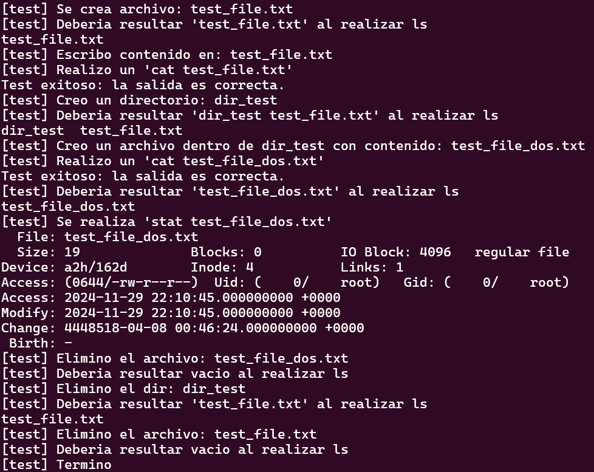
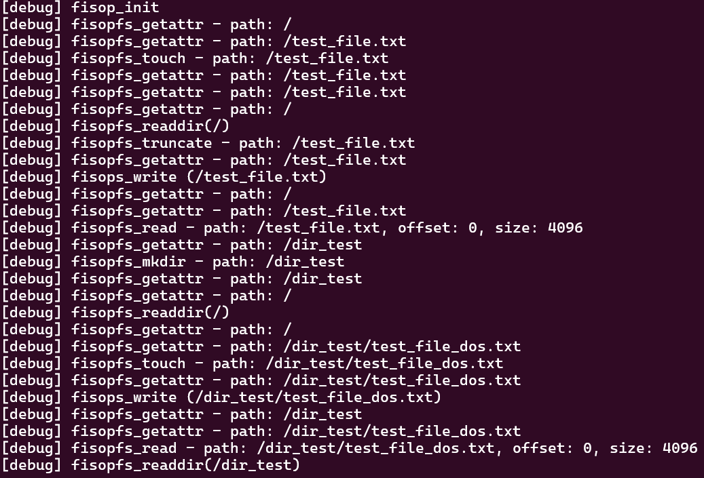
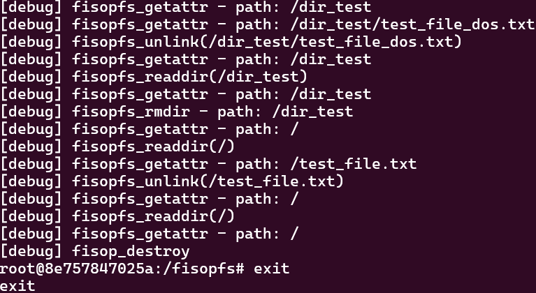

# fisop-fs

# Elecciones de diseño adoptadas para desarrollar nuestro sistema de archivos

## Estructuras en memoria

El sistema de archivos que implementamos está compuesto por una estructura `inode` que representa a archivos y directorios, y almacena sus metadatos. Los campos principales de esta son:

* `type`: indica si un archivo es regular (REG) o un directorio (DIR)
* `mode`: almacena los permisos y el tipo de archivo
* `size`: tamaño del archivo en bytes
* `uid` y `gid`: identificadores del usuario y grupo propietarios
* `i_atime`, `i_mtime` y `i_ctime`: tiempos de último acceso, modificación y cambio de metadatos
* `path`: ruta absoluta del archivo o directorio
* `content`: contenido del archivo (para archivos regulares)
* `directory_path`: ruta del directorio padre

Luego también está compuesto por una estructura `super_block` que contiene información global del sistema de archivos:

* `inodes[MAX_INODES]`: arreglo de inodos utilizados para almacenar los archivos y directorios
* `bitmap_inodes[MAX_INODES]`: bitmap que indica si un inodo está libre (FREE) u ocupado (OCCUPIED)

## Búsqueda de archivos por ruta

El sistema de archivos utiliza la función `get_inode_index(const char *path)` para encontrar un archivo o directorio dado su ruta, el proceso de búsqueda es el siguiente:

1) Se compara la ruta proporcionada con el campo `path` de cada inodo ocupado en el arreglo `inodes`
2) Si se encuentra un inodo cuyo `path` coincide con la ruta dada, se retorna el índice de ese inodo
3) Si no se encuentra ninguna coincidencia, se retorna `-1` indicando que el archivo o directorio no existe

## Estructuras auxiliares utilizadas

Utilizamos un bitmap de inodos `bitmap_inodes` que es un arreglo que indica el estado de cada inodo, si un elemento está en 0 indica que el inodo está libre y puede ser asignado (FREE) y si está en 1 indica que el inodo está en uso (OCCUPIED). Luego funciones auxiliares de ayuda para poder realizar las operaciones requeridas: `parse_path(const char *path)` que procesa la ruta recibida para obtener una versión manejable internamente ya que elimina el carácter inicial `/`, y `get_parent_path(char *parent_path)` que modifica la ruta recibida para obtener el directorio padre ya que trunca el último `/`

Por último también utilizamos constantes y enumeraciones que nos ayudaron a dar más claridad en el código y ayudar a que sea más descriptivo. Constantes como `MAX_INODES`, `MAX_CONTENT`, `MAX_PATH`, `FREE`, `OCCUPIED`, etc. Y la enumeración `inode_type` que define los tipos de inodo: `DIR`para un directorio y `REG` para un archivo regular

## Formato de serialización en disco

El sistema de archivos implementa la persistencia utilizando un archivo llamado `persistence_file.fisop`. Al desmontar el sistema de archivos o al llamar a la función `fisopfs_flush` se serializa el `super_block` completo y se escribe en el archivo de persistencia, se utiliza `fwrite` para volcar en disco el contenido de `_super_block` que incluye los inodos y el bitmap

Para la recuperación al iniciar el sistema de archivos con la llamada a `fisopfs_init` se verifica si el archivo de persistencia existe. Si existe se lee el contenido con `fread`y se carga en `_super_block`. Si no existe se inicializa el sistema de archivos llamando a `initialize_filesystem`, creando el directorio raíz y estableciendo los inodos y bitmap en memoria

## Información relevante

Para poder testear que la persistencia funciona correctamente es necesario desmontar el sistema de archivos y luego volver a montarlo, para así observar que se persisten los datos

## Pruebas

Para correr las pruebas se deben hacer los siguientes comandos en una consola:

make docker-run

make (La primera vez que se corre)

mkdir prueba (La primera vez que se corre)

./fisopfs -f prueba/

En otra consola, se debe ejecutar:

make docker-attach

chmod +x test.sh (La primera vez)

./test.sh

Los resultados que obtuvimos al correr las pruebas fueron:

Los resultados desde la primera consola fueron:

