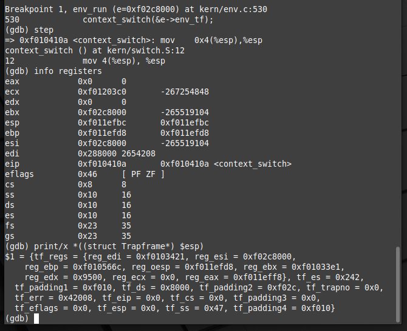
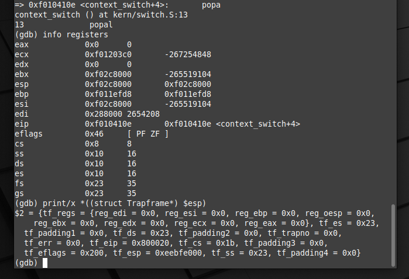
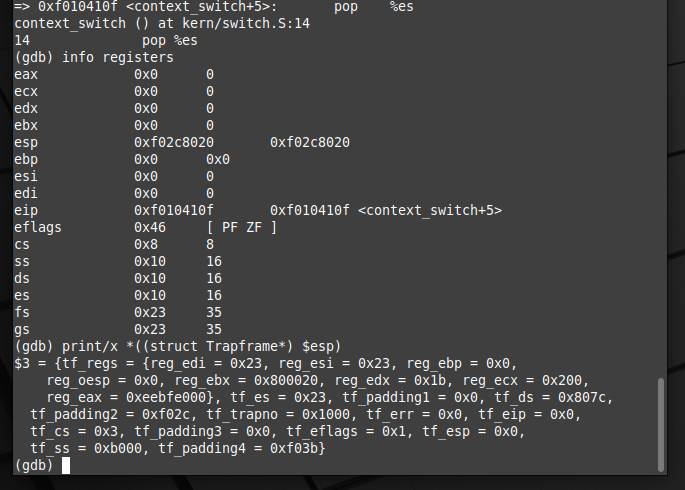
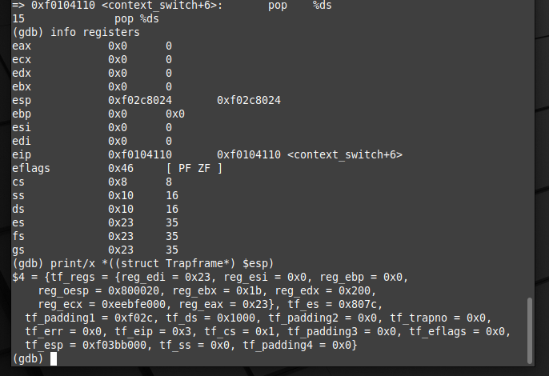
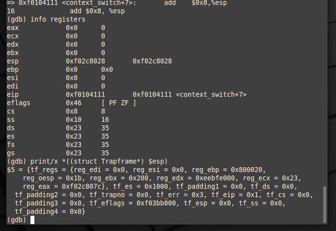
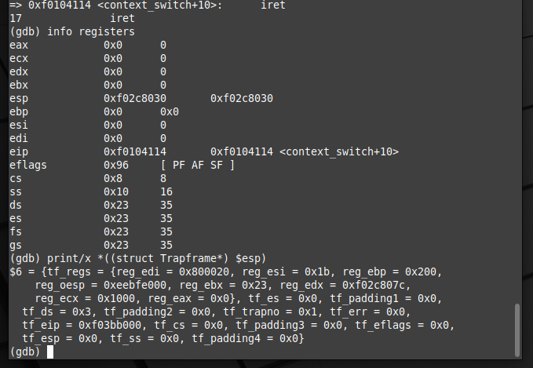
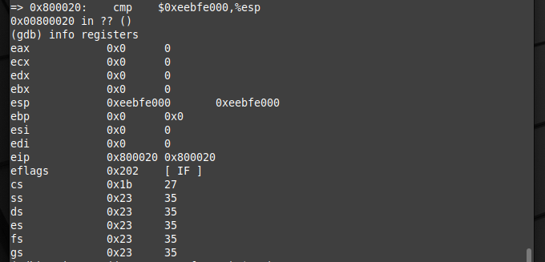

# sched

Lugar para respuestas en prosa, seguimientos con GDB y documentación del TP.

## Cambio de contexto kernel a usuario

A continuación realizaremos el seguimiento del cambio de contexto de modo kernel a modo usuario usando la herramienta GDB, mostrando capturas del estado de los registros y el stack en cada caso.

1) Inicio del cambio de contexto


2) Estado luego de ejecutar la instrucción mov


3) Estado luego de ejecutar la instrucción popal


4) Estado luego de ejecutar la instrucción pop %es


5) Estado luego de ejecutar la instrucción pop %ds


6) Estado luego de ejecutar la instrucción add y antes de ejecutar iret


7) Estado luego de ejecutar la instrucción iret


## Implementación SCHED_PRIORITIES
Para la implementacion del scheduler implementamos el Proportional Share, donde el scheduler intenta garantizar que cada proceso obtenga cierto porcentaje del tiempo de CPU. Se determina e proceso a ser ejecutado con un sorteo, distribuyendo la prioridad de tickets de loteria. Cada proceso puede tener distinta cantidad de tickets y estos pueden variar.

### 1. Cálculo del total de tickets:
Antes de realizar la planificación, se calcula el total de tickets asignados a todos los entornos ejecutables en el sistema. Cada entorno tiene un número de tickets asociado que determina su probabilidad de ser seleccionado para ejecución.

```c
	static int calculate_total_tickets(void) {
		int total_tickets = 0;
		for (int i = 0; i < NENV; i++) {
			if (envs[i].env_status == ENV_RUNNABLE) {
				total_tickets += envs[i].tickets;
			}
		}
		return total_tickets;
	}
```

### 2. Selección de un ticket ganador:
Se genera aleatoriamente un número entero en el rango de 0 a total_tickets - 1, donde total_tickets es el total de tickets calculado en el paso anterior. Este número aleatorio representa el ticket ganador.

```c
	int winning_ticket = next_random() % total_tickets;
```

### 3. Búsqueda del entorno ganador:
Se realiza una búsqueda entre los entornos ejecutables para encontrar el entorno cuyo rango de tickets incluya el número ganador. Esto se hace acumulando los números de tickets de los entornos en un sumador y deteniéndose cuando se supera el número ganador.

```c
	for (int i = 0; i < NENV; i++) {
		ticket_sum += envs[i].tickets;
		if (envs[i].env_status == ENV_RUNNABLE && ticket_sum > winning_ticket) {
			int j = 0;
			// Verificar si el proceso ya está en la lista de procesos a ejecutar
			while (j < envs_to_run_total) {
				if (envs_to_run[j]->tickets != envs[i].tickets) {
					break;
				}
				j++;
			}
			// Si el proceso no está en la lista de procesos a ejecutar, agregarlo
			if (j == envs_to_run_total) {
				envs_to_run[envs_to_run_total] = &envs[i];
				envs_to_run_total++;
			}
		}
	}
```

Después de seleccionar el entorno ganador:

 - Se ajusta su cantidad de tickets si es mayor que el mínimo permitido.

 - Se incrementa el contador de ejecuciones totales.
 
 - Se registra el ID del entorno ganador en un arreglo para propósitos de seguimiento.
 
 - Se ejecuta el entorno seleccionado utilizando la función env_run.
  
```c
	// Ejecuta el proceso ganador final
	static void run_winning_process(struct Env *envs_to_run[], int envs_to_run_total) {
		if (envs_to_run_total > 0) {
			int final_winner = next_random() % envs_to_run_total;
			struct Env *final_env = envs_to_run[final_winner];
			
			if (final_env->tickets > MIN_TICKETS)
				final_env->tickets--;
				
			sched_total_executions++;
			pid[pid_index++] = final_env->env_id;
			env_run(final_env);
		}
	}
```

### 4. Repetición del proceso:

Este proceso de selección de un ticket ganador y ejecución del entorno ganador se repite cada vez que se llama a la función de planificación, asegurando una selección aleatoria y justa entre los entornos ejecutables en función de sus prioridades (tickets).

## Descripción de las Pruebas para las syscalls

### getpriority.c

Esta prueba es útil para comprender cómo el sistema maneja las prioridades de los procesos al utilizar fork(). Al realizar esta prueba, se puede verificar:

 - La prioridad del proceso padre y del proceso hijo.
 - Ambas prioridades deberían ser las mismas inmediatamente después de la bifurcación, ya que el proceso hijo hereda la prioridad del padre en el momento de la creación.

### lowerpriority.c
El propósito de esta prueba es verificar el comportamiento del sistema al bajar las prioridades de un proceso. Específicamente, se quiere determinar:
 - La prioridad inicial del proceso.
 
 - Cuántas veces puede bajarse la prioridad antes de que ya no sea posible reducirla más.
 
 - La prioridad final después de intentar bajar la prioridad al máximo.
  
El procedimiento de la prueba se basa en llamar a sys_get_priority() para ir imprimiendo el estado final de las prioridades, tras repetidas llamadas a la syscall sys_lower_priority() en un bucle while que continúa ejecutándose hasta que esta función retorna un valor distinto de 0 (esto indica que la prioridad no puede bajarse más).
Esta prueba es útil para comprender cómo el sistema maneja las prioridades de los procesos y para asegurarse de que las funciones sys_get_priority() y sys_lower_priority() funcionan correctamente. Al realizar esta prueba, se pueden identificar posibles límites o restricciones en la gestión de prioridades, así como cualquier comportamiento anómalo al tratar de bajar la prioridad de un proceso repetidamente.
